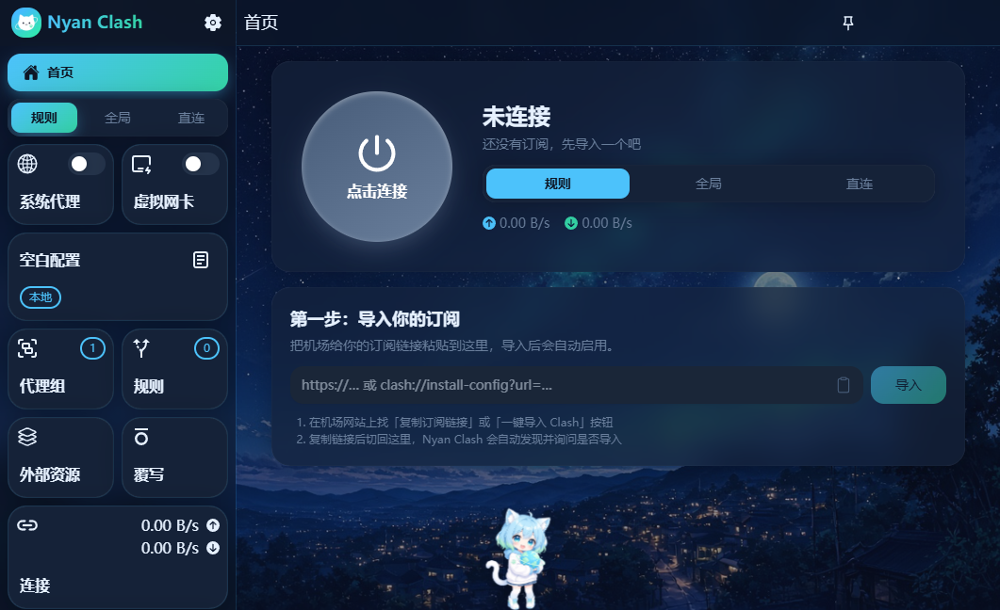
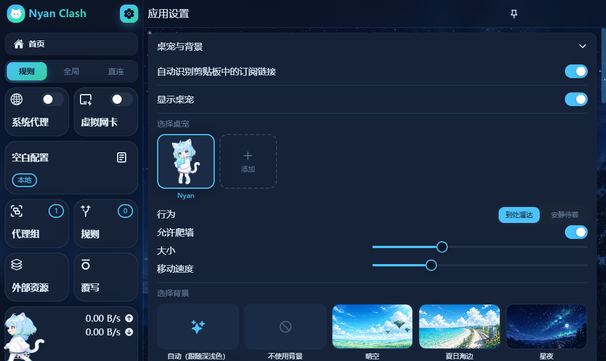
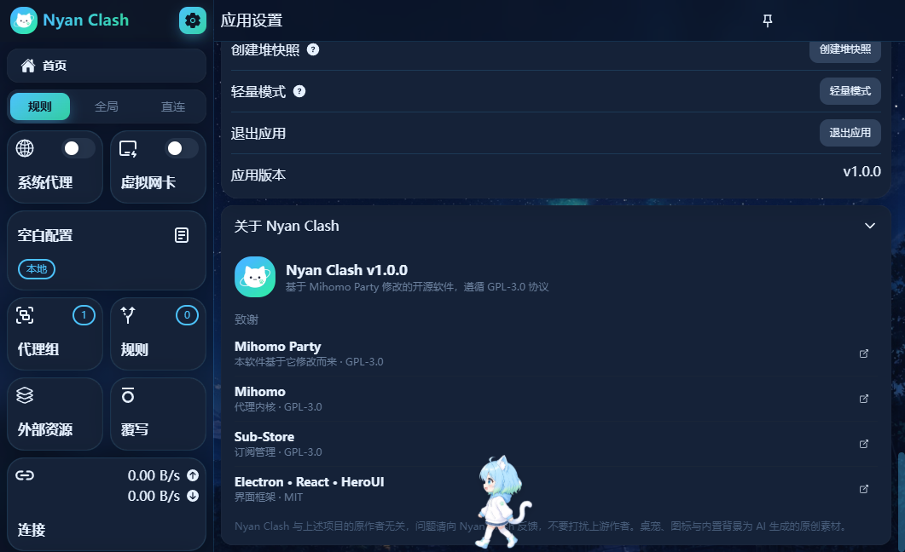

<h1 align="center">
  <br />
  Nyan Clash
</h1>

<p align="center">一个更可爱、更好上手的二次元风格 <a href="https://github.com/MetaCubeX/mihomo">Mihomo</a> 图形界面</p>

<p align="center">
  基于 <a href="https://github.com/mihomo-party-org/mihomo-party">Mihomo Party</a> 修改 · GPL-3.0 开源
</p>

<p align="center">
  
</p>

## 和原版相比有什么不同

**二次元外观**

- 天空蓝 + 薄荷绿配色、大圆角卡片、渐变按钮，深浅色主题都重新调过
- AI 生成的原创猫娘图标

**桌宠**

- 猫娘会在窗口里走路、爬墙、睡觉，可以拎起来扔出去，点她会说话
- 能导入自己的桌宠：用 5 张姿势图片创建，或导入别人分享的 `.json` 桌宠包；也能把自己的桌宠导出分享

**背景**

- 内置晴空、夏日海边、星夜，以及带星星闪烁和流星的「星夜·流星」动态背景
- 支持导入图片、GIF / APNG / 动态 WebP 动图和 MP4 / WebM 视频作为壁纸
- 遮罩强度和背景模糊可调；窗口最小化时动态背景自动暂停，不白白耗电

**更好上手**

- 新的首页：一个大号「一键连接」按钮、实时网速、当前订阅的流量和到期时间、一键测速并切到最快节点
- 第一次使用时直接在首页粘贴订阅链接导入，导入后自动启用
- 复制订阅链接后切回软件，会自动识别并询问是否导入（只认订阅地址，链接里的 token 不会显示也不会保存）
- 设置页把不常用的选项收进「高级设置」

<p align="center">
  
  
</p>

原版的全部功能（Smart 内核、TUN、覆写、Sub-Store、WebDAV 备份等）都保留着。

## 下载

到 [Releases](../../releases) 下载：

- `nyan-clash-windows-版本号-x64-setup.exe`：安装版
- `nyan-clash-windows-版本号-x64-portable.7z`：免安装版，解压后运行 `Nyan Clash.exe`

安装包没有数字签名，Windows 提示「已保护你的电脑」时，点「更多信息 → 仍要运行」。第一次打开会让你选择配置模式，一般选「标准模式」。

目前只在 Windows 10 / 11 上测试过。

## 自己编译

需要 Node.js 22+ 和 pnpm。

```bash
pnpm install
pnpm dev          # 开发模式
pnpm build:win    # 打包 Windows 安装包，产物在 dist/
```

国内网络可以设置镜像：`ELECTRON_MIRROR=https://npmmirror.com/mirrors/electron/`、`ELECTRON_BUILDER_BINARIES_MIRROR=https://npmmirror.com/mirrors/electron-builder-binaries/`。

## 自制桌宠包

桌宠包是一个 `.json` 文件，图片以 data URL 内嵌，只有 `stand` 必填，缺少的姿势会用站立图代替：

```json
{
  "name": "我的桌宠",
  "author": "你的名字",
  "sprites": {
    "stand": { "src": "data:image/png;base64,..." },
    "walk": { "src": "...", "facing": "left" },
    "climb": { "src": "...", "facing": "right" },
    "drag": { "src": "...", "scale": 1.05 },
    "sleep": { "src": "...", "scale": 0.6 }
  },
  "lines": ["点击时随机说的话"]
}
```

`facing` 表示图片里角色朝哪边（爬墙姿势表示墙在哪一侧），`scale` 是相对站立图的显示比例。最简单的做法是在 设置 → 桌宠与背景 里用图片创建，再点「导出为桌宠包」。

## 主要修改

相对上游 Mihomo Party 的改动集中在这些位置，方便对照：

| 位置                                | 内容                                    |
| ----------------------------------- | --------------------------------------- |
| `src/renderer/src/pages/home.tsx`   | 新首页                                  |
| `src/renderer/src/components/nyan/` | 桌宠、背景、剪贴板识别、设置与关于卡片  |
| `src/renderer/src/nyan/`            | 桌宠包 / 背景的数据格式、存储与订阅导入 |
| `src/renderer/src/assets/`          | 主题配色、样式，以及桌宠和背景素材      |
| `build/`、`resources/`              | 应用图标                                |
| `src/main/resolve/autoUpdater.ts`   | 关闭指向上游的自动更新                  |

另外改了应用名称、数据目录（`%APPDATA%\nyan-clash`）和版本号。完整差异可以用 git 查看。

## 致谢

- [Mihomo Party](https://github.com/mihomo-party-org/mihomo-party)（GPL-3.0）：本项目基于它修改而来，绝大部分功能来自原作者们的工作
- [Mihomo](https://github.com/MetaCubeX/mihomo)（GPL-3.0）：代理内核
- [Sub-Store](https://github.com/sub-store-org/Sub-Store)（GPL-3.0）：订阅管理
- [Electron](https://www.electronjs.org)、[React](https://react.dev)、[HeroUI](https://www.heroui.com) 等开源项目

Nyan Clash 与上述项目的作者无关。使用中遇到问题，请在本仓库提 issue，不要去打扰上游作者。

## 声明

- 本项目仅用于学习和交流图形界面开发，不提供任何代理服务或节点，请遵守你所在地区的法律法规
- 桌宠、图标与内置背景为 AI 生成的原创素材

## 许可证

[GPL-3.0](./LICENSE)。你可以自由使用、修改和分发，但分发修改版时同样需要以 GPL-3.0 开源并提供源代码。
